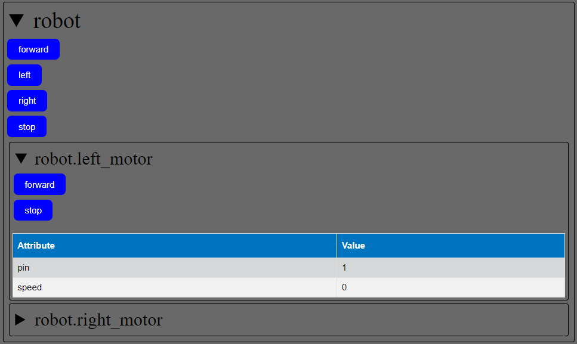

# PyObjectInterface


Quickly control any python object through an async web interface.

`pip install PyObjectInterface`
```python
from PyObjectInterface.WebController import create_WebController
import flask

app = flask.Flask('Demo')
any_python_object = ...
create_WebController(any_python_object, 'any_python_object', app)
app.run()
```

Go to `http://127.0.0.1:5000/webcontroller`

## Example: Async Robot Control


The above interface was automatically created from:
```python
class DriveMotor:
    def __init__(self, pin):
        self.pin = pin
        self.speed = 0

    def forward(self): ...
    def stop(self): ...

class Robot:
    def __init__(self):
        self.left_motor = DriveMotor(1)
        self.right_motor = DriveMotor(2)

    def forward(self): ...
    def stop(self): ...
    def left(self): ...
    def right(self): ...
```

Look at [PyObjectInterface/examples/example.py](PyObjectInterface/examples/example.py) for more information.

## Advanced Usage and Settings

You can use PyObjectInterface without the WebController.

### create_WebController
 - `obj`: Any python object
 - `name: str`: Friendly name for object, generally the name of the variable that refers to the object
 - `flask_app`: return value of flask.Flask()
 - `recursion_depth = 5`: maximum layers of subobjects to include
 - `create_private_interface = True`: if `True` creates a `/webcontroller/private` page that includes private methods and attributes